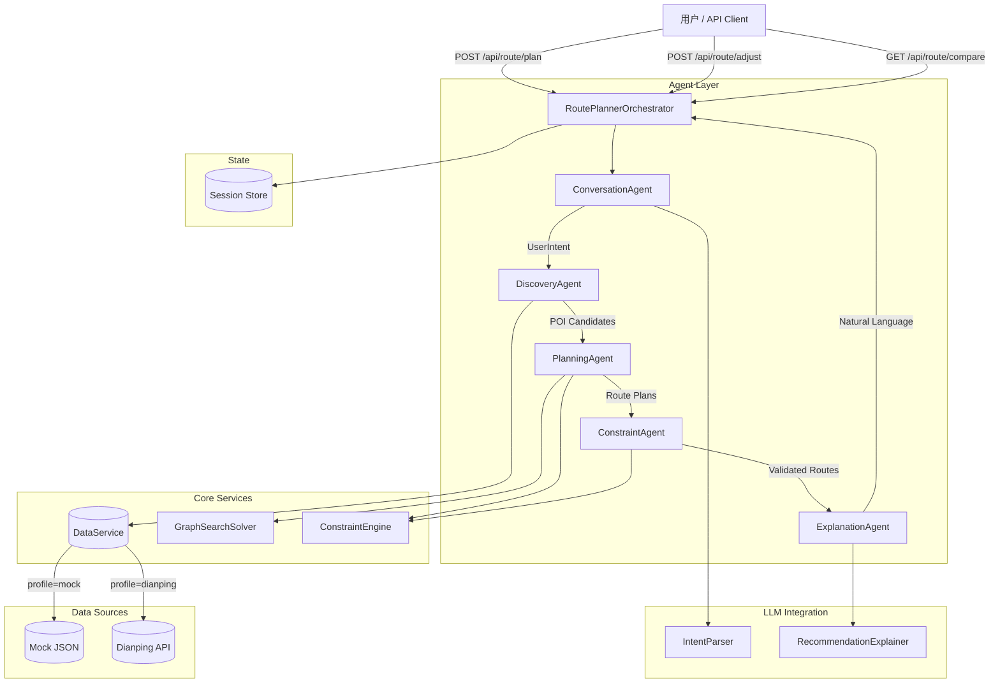
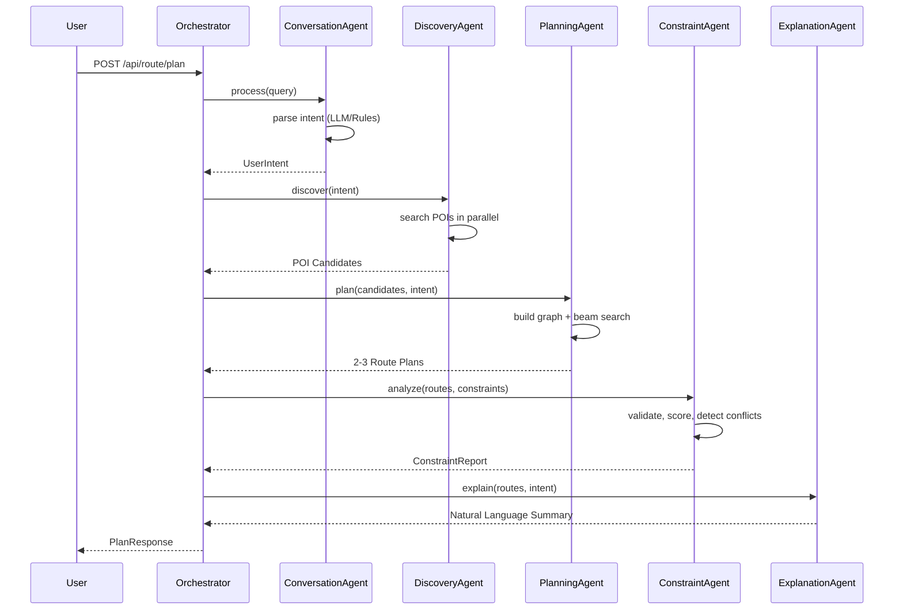

# AI 本地智能路线规划系统

> 美团黑客松 — 赛道五：基于多 Agent 协同的智能路线规划后端服务

## 系统架构



## Agent 协作流程



## 技术栈

| 组件 | 技术 | 版本 |
|------|------|------|
| 语言 | Java | 24 |
| 框架 | Spring Boot (WebFlux) | 3.4.4 |
| 图算法 | JGraphT | 1.5.2 |
| LLM 集成 | LangChain4j | 1.0.0-beta3 |
| 构建工具 | Maven | 3.9+ |
| 数据 | 内存 + JSON | — |
| 测试 | JUnit 5 + Mockito | — |

## 快速启动

### 前提条件

- JDK 24（开启预览特性）
- Maven 3.9+

### 1. 编译

```bash
# 确保使用 Java 24
java --version  # 应显示 24

# 编译
mvn clean compile
```

### 2. 运行

```bash
# 使用 Mock 数据（默认）
mvn spring-boot:run

# 或使用 Dianping API（需配置密钥）
mvn spring-boot:run -Dspring-boot.run.profiles=dianping

# 或直接运行 jar
mvn clean package -DskipTests
java --enable-preview -jar target/route-planner-1.0.0.jar
```

### 3. Docker 部署

```bash
docker-compose up --build
```

## API 文档

### 1. 路线规划

```bash
POST /api/route/plan
Content-Type: application/json

{
  "query": "周末下午去三里屯逛街，然后吃日料",
  "sessionId": null
}
```

**响应示例：**

```json
{
  "sessionId": "sess_abc12345",
  "routes": [
    {
      "id": "route_xyz",
      "name": "体验最优方案",
      "segments": [...],
      "totalCost": 480.0,
      "totalTravelTime": 18.0,
      "totalRating": 9.1,
      "optimizationGoal": "BEST_EXPERIENCE"
    }
  ],
  "explanation": "为您规划了3条三里屯路线方案..."
}
```

### 2. 动态调整

```bash
POST /api/route/adjust
Content-Type: application/json

{
  "sessionId": "sess_abc12345",
  "adjustment": "日料换成评分 4.5 以上的火锅"
}
```

### 3. 方案对比

```bash
GET /api/route/compare/{sessionId}
```

### 4. 健康检查

```bash
GET /api/route/health
```

## 演示场景

### 场景一：基础串联

```bash
curl -X POST http://localhost:8080/api/route/plan \
  -H "Content-Type: application/json" \
  -d '{"query": "周末下午去三里屯逛街，然后吃日料", "sessionId": null}'
```

预期结果：生成 3 条三里屯路线，包含购物 → 日料的串联方案。

### 场景二：多约束

```bash
# 第一步：生成带约束的路线
curl -X POST http://localhost:8080/api/route/plan \
  -H "Content-Type: application/json" \
  -d '{"query": "带女朋友去国贸，预算400，要拍照好看的餐厅，然后看电影，少走路", "sessionId": null}'
```

预期结果：生成满足预算约束的国贸路线，包含拍照好看的餐厅 + 电影院。

### 场景三：动态调整

```bash
# 第一步：创建基础方案
curl -X POST http://localhost:8080/api/route/plan \
  -H "Content-Type: application/json" \
  -d '{"query": "周末下午去三里屯逛街，然后吃日料", "sessionId": null}'

# 第二步：拿到 sessionId 后调整
curl -X POST http://localhost:8080/api/route/adjust \
  -H "Content-Type: application/json" \
  -d '{"sessionId": "sess_xxx", "adjustment": "日料换成评分4.5以上的火锅"}'
```

预期结果：保留已有方案的前缀，仅替换餐饮部分，实现局部重规划。

## 项目结构

```
src/main/java/com/meituan/route
├── agent/                    # 多 Agent 实现
│   ├── ConversationAgent.java    # 对话理解 Agent
│   ├── DiscoveryAgent.java       # POI 发现 Agent
│   ├── PlanningAgent.java        # 路线规划 Agent
│   ├── ConstraintAgent.java      # 约束验证 Agent
│   └── ExplanationAgent.java     # 解释生成 Agent
├── orchestrator/             # 主控编排
│   └── RoutePlannerOrchestrator.java
├── data/                     # 数据源
│   ├── DataService.java          # 数据服务接口
│   ├── MockDataService.java      # Mock 实现（200+ POI）
│   └── DianpingApiDataService.java # 大众点评 API 实现
├── model/                    # 领域模型
│   ├── POI.java                 # 兴趣点（record）
│   ├── Route.java               # 路线（record）
│   ├── Constraint.java          # 约束（record）
│   └── UserIntent.java          # 用户意图（record）
├── solver/                   # 算法引擎
│   ├── GraphSearchSolver.java   # 图搜索求解器（Beam Search）
│   ├── ConstraintEngine.java    # 约束引擎
│   └── TimeWindowChecker.java   # 时间窗检查
├── llm/                      # LLM 集成
│   ├── IntentParser.java        # 意图解析
│   └── RecommendationExplainer.java # 推荐解释
├── state/                    # 会话状态
│   └── SessionStateManager.java
├── config/                   # 配置
│   └── AppConfig.java
├── RouteController.java      # REST API
└── RouteApplication.java     # 启动入口
```

## 核心算法：混合路线求解

采用 **LLM-as-Parser + Beam Search** 混合架构：

1. **LLM/规则解析**：`IntentParser` 将自然语言转为结构化的 `UserIntent`（区域、类别、预算、时间窗等）
2. **图构建**：基于候选 POI 构建带权有向图，节点 = POI，边 = 步行/驾车时间（Haversine 距离估算）
3. **Beam Search**：多目标优化搜索
   - `BEST_EXPERIENCE`：最大化评分 + 热度
   - `FASTEST`：最小化行程时间
   - `CHEAPEST`：最小化花费
4. **约束验证**：硬约束（时间窗）剪枝，软约束（预算、评分、排队）加权评分
5. **冲突消解**：逐级放松软约束，先降低优先级最低的约束，再放大预算上限

## Java 24 新特性运用

- **Records**：所有领域模型（`POI`、`Route`、`Constraint`、`UserIntent`）使用 record 类型
- **Virtual Threads**：通过 `Schedulers.boundedElastic()` 在 WebFlux 中启用虚拟线程
- **Records 嵌套模式**：`Route.RouteSegment` 等嵌套 record
- **Stream API 增强**：`Stream.toList()`、`Collectors.groupingBy` 等

## 配置说明

### LLM 配置

在 `application.yml` 中配置：

```yaml
langchain4j:
  open-ai:
    chat-model:
      api-key: ${OPENAI_API_KEY}
      model-name: gpt-4
```

可替换为任意 OpenAI 兼容接口（包括美团内部模型）。

### 数据源切换

```bash
# Mock 数据（默认）
mvn spring-boot:run

# 大众点评 API
mvn spring-boot:run -Dspring-boot.run.profiles=dianping
```

## 测试

```bash
mvn test
```

核心测试覆盖：
- `ConstraintEngineTest`：约束构建、验证、评分、松弛
- `GraphSearchSolverTest`：Haversine 距离、Beam Search、多目标规划
