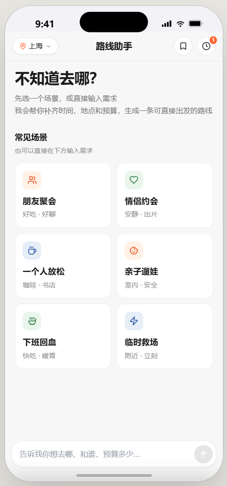
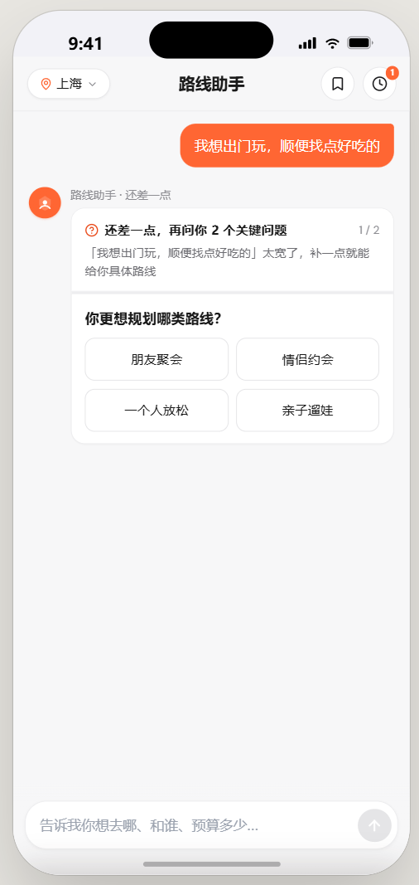
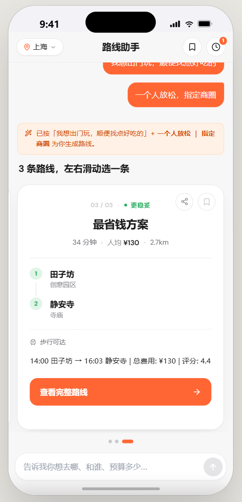
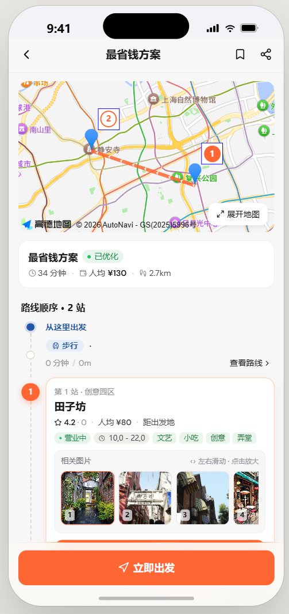
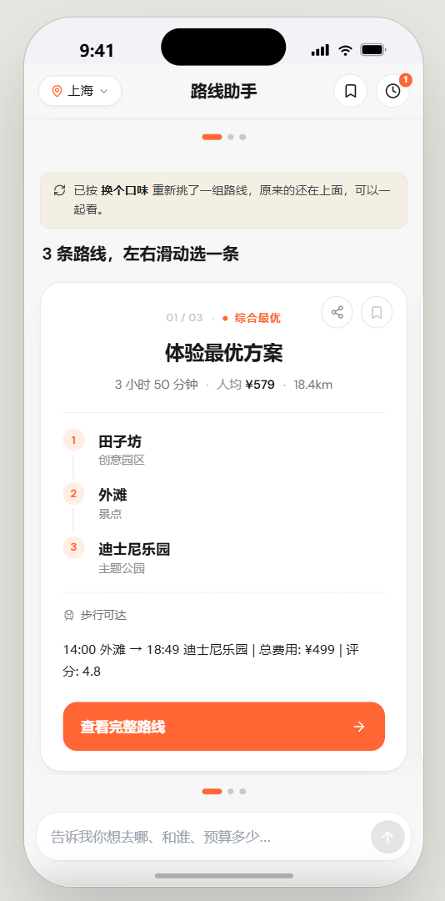
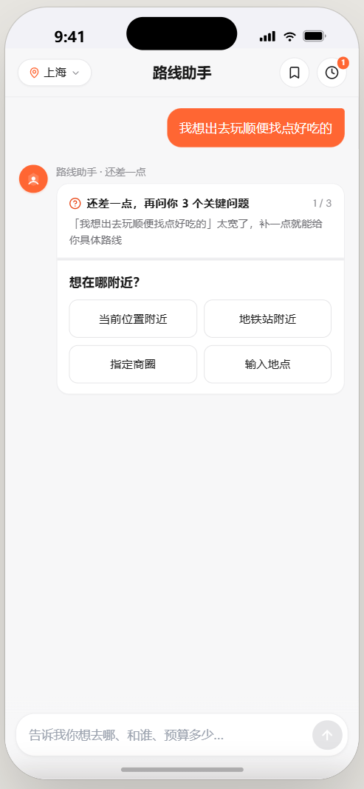

# AI 路线规划助手 (AI Route Planner)

> 美团黑客松 Track 5 — 基于多 Agent 协作的本地生活智能路线规划系统

## 项目展示

### 完整流程演示

<p align="center">
  <a href="./screenshots/demo-full.mp4">
    
  </a>
  <br/><sub>⬆ 点击播放完整演示 (MP4)</sub>
</p>

### 交互演示 (GIF)

| 自然语言对话 | 城市切换 |
|:---:|:---:|
|  |  |

| 历史记录 & 收藏 |
|:---:|
|  |

### 页面截图 (6 张)

| 首页 & 场景选择 | 需求补全 | 多路线方案 |
|:---:|:---:|:---:|
|  |  |  |

| 路线详情页 | 快捷调整 Chip | 对话界面 |
|:---:|:---:|:---:|
|  |  |  |

---

## 解决的问题

本地生活消费场景中，用户面临三大核心痛点：

1. **信息过载**：一个商圈有上百家店，用户不知道去哪、怎么走
2. **需求模糊**：用户只会说"下午想出去逛逛"，无法清晰表达约束条件（预算、排队、时间窗口等）
3. **方案对比困难**：多条路线之间的差异（性价比 vs 体验 vs 效率）难以直观比较

**AI 路线规划助手**通过自然语言对话理解用户意图，结合多 Agent 协作自动生成 2-3 条差异化路线方案。

## 覆盖人群与场景

| 人群 | 典型场景 | 核心需求 |
|------|---------|---------|
| 游客/旅行者 | 周末去三里屯逛街+吃饭 | 不熟悉商圈，需要一站式路线 |
| 约会情侣 | 拍照好看、评分高、不排队的餐厅 | 体验优先，特殊偏好（安静/氛围） |
| 亲子家庭 | 带娃逛博物馆+吃饭 | 安全、方便、适合儿童 |
| 上班族 | 下班后高效逛吃 | 时间紧，效率优先 |
| 探店博主 | 一天打卡多个网红店 | 路线最优，减少走路 |

## 系统架构

```
┌──────────────────────────────────────────────────────────────┐
│  Frontend (routeplan/)                                       │
│  React 18 + Tailwind CSS + 纯静态页面，无需构建工具             │
│                                                              │
│  入口路径:                                                    │
│    场景卡片 → NeedCompletionCard (Q&A 补全) → 路线方案         │
│    自然语言 → LLM 意图分析 → FollowupCard/ConflictCard → 路线  │
│    路线页面 → Chip 快捷调整 / 继续自然语言输入                   │
└──────────────────────┬───────────────────────────────────────┘
                       │ HTTP POST /api/route/plan | analyze | adjust
                       ▼
┌──────────────────────────────────────────────────────────────┐
│  Backend (Spring Boot 3.4 + Java 21 + WebFlux)               │
│                                                              │
│  RouteController (REST API)                                  │
│    POST /api/route/plan     — 首次路线规划                     │
│    POST /api/route/analyze  — LLM 意图分析 + 需求补全判断       │
│    POST /api/route/adjust   — 增量调整路线                     │
│    GET  /api/route/compare  — 多方案对比                       │
│                                                              │
│  RoutePlannerOrchestrator (多 Agent 编排)                     │
│    ┌──────────────────────────────────────────────┐          │
│    │         five-Agent Pipeline                  │          │
│    │                                              │          │
│    │  ┌───────────────┐  ┌──────────────────┐     │          │
│    │  │Conversation   │  │  Discovery       │     │          │
│    │  │Agent (LLM)    │  │  Agent (API)     │     │          │
│    │  └───────┬───────┘  └────────┬─────────┘     │          │
│    │          │                   │                │          │
│    │          └── Mono.zip 真并行 ─┘                │          │
│    │                     │                         │          │
│    │          ┌──────────┴──────────┐              │          │
│    │          │  Planning Agent     │              │          │
│    │          │  (图搜索生成路线)    │              │          │
│    │          └──────────┬──────────┘              │          │
│    │                     │                         │          │
│    │          ┌──────────┴──────────┐              │          │
│    │          │  Constraint Agent   │              │          │
│    │          │  (约束验证+打分)     │              │          │
│    │          └──────────┬──────────┘              │          │
│    │                     │                         │          │
│    │          ┌──────────┴──────────┐              │          │
│    │          │  Explanation Agent  │              │          │
│    │          │  (模板引擎, <50ms)   │              │          │
│    │          └─────────────────────┘              │          │
│    └──────────────────────────────────────────────┘          │
│                                                              │
│  Infrastructure                                               │
│  ┌──────────┬──────────┬──────────┬──────────────────┐       │
│  │DeepSeek  │ JGraphT  │PostgreSQL│ 美团点评/高德 API │       │
│  │LLM 意图  │图算法求解│ 持久化    │ 实时商户数据      │       │
│  └──────────┴──────────┴──────────┴──────────────────┘       │
└──────────────────────────────────────────────────────────────┘
```

### 延迟优化：真并行执行

**v1 问题：** 编排器代码注释写"并行执行"，但 Reactor 的 Mono 是惰性求值——Discovery Mono 在 LLM 完成后才被订阅，实际是**串行**的（5s LLM + 3s API = 8s+）。

**v2 修复：** 使用 `Mono.zip(llmMono, discoveryMono)` 让两者**真正同时执行**。

```
修复前 (串行):  LLM ████████░░ API ████░░ 规划 ██░░ 约束 ░ 解释 ░  ≈ 10-15s
修复后 (并行):  LLM ████████░░                         ≈ 6-8s
                API ████░░       规划 ██░░ 约束 ░ 解释 ░
                ←── max(LLM, API) ──→
```

**耗时分布（修复后）：**

| 步骤 | Agent | 耗时 | 备注 |
|------|-------|------|------|
| 意图解析 | ConversationAgent | 2-5s | DeepSeek API，与 Discovery 并行 |
| POI 发现 | DiscoveryAgent | 1-3s | Mock 瞬时，Dianping API 3s，与 LLM 并行 |
| 路线生成 | PlanningAgent | 0.5-2s | JGraphT Beam Search |
| 约束验证 | ConstraintAgent | <100ms | 硬约束剪枝 + 软约束加权 |
| 方案解释 | ExplanationAgent | <50ms | **模板引擎**，非 LLM 调用 |
| **总计** | | **约 4-7s** | max(LLM, Discovery) + 后续 |

ExplanationAgent 使用 `RecommendationExplainer`（`src/.../llm/RecommendationExplainer.java`），是基于 `TAG_PRAISE` 标签映射表的**纯模板引擎**，不产生额外 LLM Token 消耗。

---

## 数据库设计

项目使用 **PostgreSQL 15+** 持久化会话和路线数据。Flyway 管理 4 张迁移表：

### 表结构

| 表 | 用途 | 关键字段 |
|---|---|---|
| `sessions` | 对话会话 | `id`, `intent_json`（序列化的 UserIntent）, `created_at`, `updated_at` |
| `session_snapshots` | 每次路线的快照版本 | `session_id` FK, `version`, `route_json`, `intent_json` |
| `routes` | 生成的路线记录 | `id`, `session_id`, `name`, `segments_json`, `total_cost`, `optimization_goal`, `score` |
| `favorites` | 用户收藏 | `route_json`, `route_name`, `scene`, `poi_count`, `total_time`, `total_cost` |

### 迁移脚本

| 文件 | 内容 |
|------|------|
| `src/main/resources/db/migration/V1__init.sql` | 健康检查表 |
| `src/main/resources/db/migration/V2__sessions.sql` | 会话 + 快照表 |
| `src/main/resources/db/migration/V3__routes.sql` | 路线表 |
| `src/main/resources/db/migration/V4__favorites.sql` | 收藏表 |

### 为什么不需要 MySQL？

- PostgreSQL 已在项目中完整配置（端口 5433），Flyway 迁移 + JPA Entity + Repository 齐全
- **商家数据不存数据库**——通过美团点评 API 实时获取，`DianpingApiDataService` 在内存中做 `ConcurrentHashMap` 缓存。商家评分、排队时间、营业状态随时变化，存库会造成数据过期
- 对话内容和路线快照已通过 `sessions` 和 `session_snapshots` 表持久化

### 数据库连接配置

`src/main/resources/application.yml`:
```yaml
spring:
  datasource:
    url: ${SPRING_DATASOURCE_URL:jdbc:postgresql://localhost:5433/liquidroute}
    username: ${SPRING_DATASOURCE_USERNAME:liquidroute}
    password: ${SPRING_DATASOURCE_PASSWORD:liquidroute}
```

**mock 模式下不需要数据库**——所有数据来自内存 Mock。但要持久化对话历史，需要启动 PostgreSQL 并去掉 mock profile。

---

## Agent 协作流程

### Agent 1: ConversationAgent — 对话理解与意图解析

- **文件**: `src/main/java/com/meituan/route/agent/ConversationAgent.java`
- **核心逻辑**:
  - 调用 `IntentParser.analyzeWithCompleteness()` → 返回 `IntentAnalysisResult`
  - LLM（DeepSeek v4 Flash）将自然语言转为结构化 `UserIntent`（城市、商圈、品类、预算、评分、排队容忍度、出行方式、优化目标等 15 个字段）
  - **完整性检查**：判断 stage（complete / assumption / followup / conflict），生成追问问题
  - LLM 不可用时自动降级为规则匹配
- **输出**: `ConversationResult` → 传给 Agent 2 和 Agent 3

### Agent 2: DiscoveryAgent — POI 候选发现

- **文件**: `src/main/java/com/meituan/route/agent/DiscoveryAgent.java`
- **核心逻辑**:
  - 按品类并行搜索 POI（`DataService.searchByCategory()`）
  - 硬约束过滤 → 按评分+热度排序 → Top 20
  - mock 模式：内置 50+ POI（北京 30+，上海 20 个）
  - dianping 模式：美团点评 API → 高德降级
- **输出**: `DiscoveryResult` → 传给 Agent 3

### Agent 3: PlanningAgent — 路线方案生成

- **文件**: `src/main/java/com/meituan/route/agent/PlanningAgent.java`
- **核心逻辑**:
  - 构建 POI 连通图 → `GraphSearchSolver` Beam Search 生成 2-3 条差异化路线
  - 无解时自动松弛约束重试（`ConstraintEngine.relaxConstraints()`）
  - 支持增量 replan（保留前缀 POI，重规划后缀）
- **输出**: `PlanningResult` → 传给 Agent 4 和 Agent 5

### Agent 4: ConstraintAgent — 约束验证与打分

- **文件**: `src/main/java/com/meituan/route/agent/ConstraintAgent.java`
- **核心逻辑**:
  - 硬约束（时间窗口）剪枝，软约束（预算、评分、排队）加权评分
  - 增量调整时从自然语言解析新约束（如"换不排队的火锅" → `maxQueue=10, category=火锅`）
- **输出**: `ConstraintReport` → 最佳路线 ID 传给编排器

### Agent 5: ExplanationAgent — 方案解释（模板引擎，非 LLM）

- **文件**: `src/main/java/com/meituan/route/agent/ExplanationAgent.java`
- **核心逻辑**:
  - 调用 `RecommendationExplainer`（标签→推荐语映射表 + 固定模板）
  - 生成方案摘要 + 路线对比 + 小编推荐
  - **不调用 LLM**，不消耗 Token，耗时 < 50ms
- **输出**: `ExplanationResult` → 最终返回前端

### 数据流（含代码行号）

```
用户输入 "周末三里屯逛街拍照，人均200"
         │
         ▼
RouteController.java  ──  POST /api/route/plan | analyze
         │
         ▼
RoutePlannerOrchestrator.java ──  Mono.zip(
         │                           LLM 意图解析,    ← 2-5s
         │                           POI 宽搜发现     ← 1-3s
         │                         ) 真并行!
         │
         ├──→ ConversationAgent.process(query)
         │    IntentParser.analyzeWithCompleteness()
         │    产出: IntentAnalysisResult {
         │      stage: "assumption",
         │      intent: UserIntent { city="北京", district="三里屯",
         │        categories=["SHOPPING"], budget=200, keywords=["拍照"] },
         │      missingFields: ["preferences"],
         │      followupQuestions: [{ id:"mood", label:"更想要什么体验？", ... }]
         │    }
         │
         └──→ DiscoveryAgent.discover(broadIntent)
              DataService.searchByCategory/mock
              产出: 50+ POI → filterForIntent → 20 候选
                     │
                     ▼
              PlanningAgent.plan(discovery, intent)
              GraphSearchSolver.generatePlans(candidates, constraints, intent, 3)
              产出: 2-3 条 Route
                     │
                     ├──→ ConstraintAgent.analyze(routes, constraints, intent)
                     │    产出: ConstraintReport { bestRoute, allFeasible, scores }
                     │
                     └──→ ExplanationAgent.explain(routes, intent)  ← 模板引擎，<50ms
                          产出: ExplanationResult { summary, comparisonHtml }
                     │
                     ▼
              PlanResponse → 前端展示
```

---

## 技术栈

### Backend

| 技术 | 用途 | 版本 |
|------|------|------|
| Java | 核心语言 | 21 |
| Spring Boot | 应用框架 | 3.4.4 |
| Spring WebFlux | 响应式 HTTP 服务（Reactor） | 3.4.4 |
| Spring Data JPA | ORM（会话+路线持久化） | — |
| PostgreSQL | 数据库（会话/快照/路线/收藏） | 15+ |
| Flyway | 数据库迁移管理 | — |
| LangChain4j | LLM 集成框架（OpenAI 兼容接口） | 1.0.0-beta3 |
| DeepSeek v4 Flash | 大语言模型（意图解析） | deepseek-v4-flash |
| JGraphT | POI 连通图构建 + Beam Search | 1.5.2 |
| 美团开放平台 API | 实时商户数据 | — |
| 大众点评 API | 商户数据（降级链路） | — |
| 高德地图 Web API | 地理编码 / POI 搜索（二次降级） | — |
| Maven | 构建工具 | 3.9+ |
| JUnit 5 + Mockito | 测试框架 | — |

### Frontend

| 技术 | 用途 |
|------|------|
| React 18 | UI 框架（UMD CDN 引入，零构建） |
| Tailwind CSS | 样式（CDN） |
| Babel Standalone | 浏览器端 JSX 编译 |
| Lucide Icons | 图标库 (window.Icon) |

---

## 项目结构

```
meituan/
├── README.md                              # 本文件
├── pom.xml                                # Maven 配置
│
├── src/main/java/com/meituan/route/
│   ├── RouteApplication.java              # Spring Boot 启动入口
│   ├── RouteController.java               # REST API
│   ├── FavoriteController.java            # 收藏 API
│   │
│   ├── agent/                             # ★ 5-Agent 实现
│   │   ├── ConversationAgent.java         # Agent 1: 对话+意图解析
│   │   ├── DiscoveryAgent.java            # Agent 2: POI 候选发现
│   │   ├── PlanningAgent.java             # Agent 3: 路线方案生成
│   │   ├── ConstraintAgent.java           # Agent 4: 约束验证+打分
│   │   └── ExplanationAgent.java          # Agent 5: 模板引擎解释
│   │
│   ├── orchestrator/
│   │   └── RoutePlannerOrchestrator.java  # ★ 多 Agent 编排器 (Mono.zip 真并行)
│   │
│   ├── llm/
│   │   ├── IntentParser.java              # LLM 意图解析 + 完整性分析
│   │   └── RecommendationExplainer.java   # 模板引擎推荐解释 (非 LLM)
│   │
│   ├── solver/
│   │   ├── GraphSearchSolver.java         # Beam Search 路线求解
│   │   ├── ConstraintEngine.java          # 约束构建/验证/评分/松弛
│   │   └── TimeWindowChecker.java         # 时间窗口检查
│   │
│   ├── data/
│   │   ├── DataService.java               # 数据服务接口
│   │   ├── MockDataService.java           # Mock 数据 (默认 profile, 50+ POI)
│   │   ├── DianpingApiDataService.java    # 美团点评实时 API (@Profile("dianping"))
│   │   └── GaodeGeoService.java           # 高德地理编码+POI搜索
│   │
│   ├── model/
│   │   ├── POI.java                       # 兴趣点 (record)
│   │   ├── Route.java                     # 路线 (record)
│   │   ├── UserIntent.java                # 用户意图 (record, 15 字段)
│   │   ├── Constraint.java                # 约束 (record)
│   │   └── IntentAnalysisResult.java      # LLM 意图分析结果 (record)
│   │
│   ├── entity/                            # JPA 实体
│   │   ├── SessionEntity.java
│   │   ├── SnapshotEntity.java
│   │   ├── RouteEntity.java
│   │   └── FavoriteEntity.java
│   │
│   ├── repository/                        # Spring Data JPA
│   │   ├── SessionRepository.java
│   │   ├── SnapshotRepository.java
│   │   ├── RouteRepository.java
│   │   └── FavoriteRepository.java
│   │
│   ├── state/
│   │   └── SessionStateManager.java       # 会话状态管理 (快照+版本)
│   │
│   └── config/
│       └── AppConfig.java                 # LLM Bean + CORS 配置
│
├── src/main/resources/
│   ├── application.yml                    # 应用配置 (DeepSeek/点评/高德/DB)
│   └── db/migration/                      # Flyway SQL 迁移
│       ├── V1__init.sql
│       ├── V2__sessions.sql
│       ├── V3__routes.sql
│       └── V4__favorites.sql
│
├── src/test/java/com/meituan/route/solver/
│   ├── ConstraintEngineTest.java
│   └── GraphSearchSolverTest.java
│
├── routeplan/                             # ★ 前端 (纯静态)
│   ├── index.html                         # 入口 (React CDN + Tailwind)
│   ├── app.jsx                            # 主应用 (状态机: welcome→completing→route)
│   ├── api.js                             # API 调用层
│   ├── chat-screen.jsx                    # 对话主界面
│   ├── components.jsx                     # 通用 UI (Icon, Chip, StatusPill 等)
│   ├── route-detail.jsx                   # 路线详情页
│   ├── nl-flow.jsx                        # NL 分支交互 + FollowupCard + ConflictCard
│   ├── need-completion.jsx                # 场景路径需求补全 + RouteOptionsCard
│   ├── history-panel.jsx                  # 历史记录面板
│   ├── favorites-panel.jsx                # 收藏面板
│   ├── share-panel.jsx                    # 分享面板
│   └── images/stores/                     # 店铺图片
│
├── screenshots/                           # 项目截图 (5 张已有)
│   ├── home.png
│   ├── chat.png
│   ├── need-completion.png
│   ├── route-cards.png
│   ├── route-detail.png
│   └── chip-adjust.png
│
└── image/                                 # 录屏素材 (mp4)
```

---

## 快速开始

### 环境要求

- JDK 21+
- Maven 3.9+
- PostgreSQL 15+（可选，mock profile 使用内存数据）
- DeepSeek API Key（可选，内置 Key；无 Key 时降级为规则解析）

### 启动后端

```bash
# 默认 mock profile（无需数据库，内置 Mock POI 数据，LLM 可用）
mvn spring-boot:run

# Dianping 实时数据 + DeepSeek LLM
mvn spring-boot:run "-Dspring-boot.run.profiles=dianping"
```

后端启动后监听 `http://localhost:8080`

### 启动前端

直接用浏览器打开 `routeplan/index.html`。

或本地静态服务器：

```bash
cd routeplan
npx serve .        # Node.js
# 或
python -m http.server 3000
```

### API 端点

| 方法 | 路径 | 说明 |
|------|------|------|
| POST | `/api/route/plan` | 首次路线规划 |
| POST | `/api/route/analyze` | LLM 意图分析 + 需求补全判断 |
| POST | `/api/route/adjust` | 增量调整路线 |
| GET | `/api/route/compare/{sessionId}` | 多方案对比 |
| GET | `/api/route/health` | 健康检查 |

**plan 请求示例**:

```json
{
  "query": "北京三里屯下午不想排队的日料，预算200块",
  "sessionId": null,
  "city": "北京"
}
```

**analyze 请求示例**:

```json
{
  "query": "想出去玩玩",
  "sessionId": null,
  "city": "北京"
}
```

响应：
```json
{
  "stage": "followup",
  "intent": { "city": "北京", "preferredCategories": [], ... },
  "missingFields": ["categories", "district", "budget", "preferences"],
  "followupQuestions": [
    { "id": "scene", "label": "你更想规划哪类路线？", "options": ["朋友聚会", "情侣约会", "一个人放松", "亲子遛娃"] },
    { "id": "place", "label": "想在哪附近？", "options": ["当前位置附近", "地铁站附近", "指定商圈", "输入地点"] }
  ],
  "summaryText": "综合"
}
```

### 演示场景

```bash
# 场景一：完整 NL 输入
curl -X POST http://localhost:8080/api/route/plan \
  -H "Content-Type: application/json" \
  -d '{"query": "周末下午去三里屯逛街，然后吃日料", "sessionId": null}'

# 场景二：多约束（预算+拍照+电影）
curl -X POST http://localhost:8080/api/route/plan \
  -H "Content-Type: application/json" \
  -d '{"query": "带女朋友去国贸，预算400，要拍照好看的餐厅，然后看电影，少走路", "sessionId": null}'

# 场景三：LLM 意图分析
curl -X POST http://localhost:8080/api/route/analyze \
  -H "Content-Type: application/json" \
  -d '{"query": "周末想去三里屯拍照，人均200以内", "sessionId": null}'

# 场景四：增量调整
curl -X POST http://localhost:8080/api/route/adjust \
  -H "Content-Type: application/json" \
  -d '{"sessionId": "sess_xxx", "adjustment": "少走点路，换成更便宜的"}'
```

---

## 核心算法：混合路线求解

1. **意图解析**：LLM（DeepSeek）将自然语言转为 `UserIntent`（15 个字段），并分析完整度
2. **POI 发现**：按意图品类并行搜索，硬约束过滤 → Top 20
3. **图构建**：候选 POI 构建带权有向图（边 = Haversine 距离估算）
4. **Beam Search 多目标优化**：`BEST_EXPERIENCE`（最大化评分+热度）、`FASTEST`（最小化行程）、`CHEAPEST`（最小化花费）
5. **约束验证**：硬约束（时间窗口）剪枝，软约束（预算/评分/排队）加权评分
6. **冲突消解**：逐级松弛软约束

---

## 配置说明

核心配置在 `src/main/resources/application.yml`：

| 环境变量 | 默认值 | 说明 |
|----------|--------|------|
| `DEEPSEEK_API_KEY` | (内置) | DeepSeek API Key |
| `LLM_MODEL` | `deepseek-v4-flash` | 模型名称 |
| `LLM_BASE_URL` | `https://api.deepseek.com/v1` | LLM API 地址 |
| `SPRING_DATASOURCE_URL` | `jdbc:postgresql://localhost:5433/liquidroute` | PostgreSQL |
| `SPRING_DATASOURCE_USERNAME` | `liquidroute` | 数据库用户名 |
| `SPRING_DATASOURCE_PASSWORD` | `liquidroute` | 数据库密码 |
| `MEITUAN_API_TOKEN` | (内置) | 美团开放平台 Token |
| `GAODE_API_KEY` | (内置) | 高德地图 Web API Key |

### Profile 说明

| Profile | 数据源 | LLM | 数据库 | 适用场景 |
|---------|--------|-----|--------|---------|
| `mock`（默认） | 内置 50+ POI | DeepSeek 可用 | 不需要 | 开发调试、Demo |
| `dianping` | 美团点评实时 API | DeepSeek 可用 | 需要 | 生产环境 |

---

## 关于项目组织

- `routeplan/` — Web 前端，纯静态页面，浏览器直接打开
- `pom.xml` + `src/` — Spring Boot 后端，Maven 标准布局
- 不引入 React Native / 额外构建工具，保持依赖最小化
